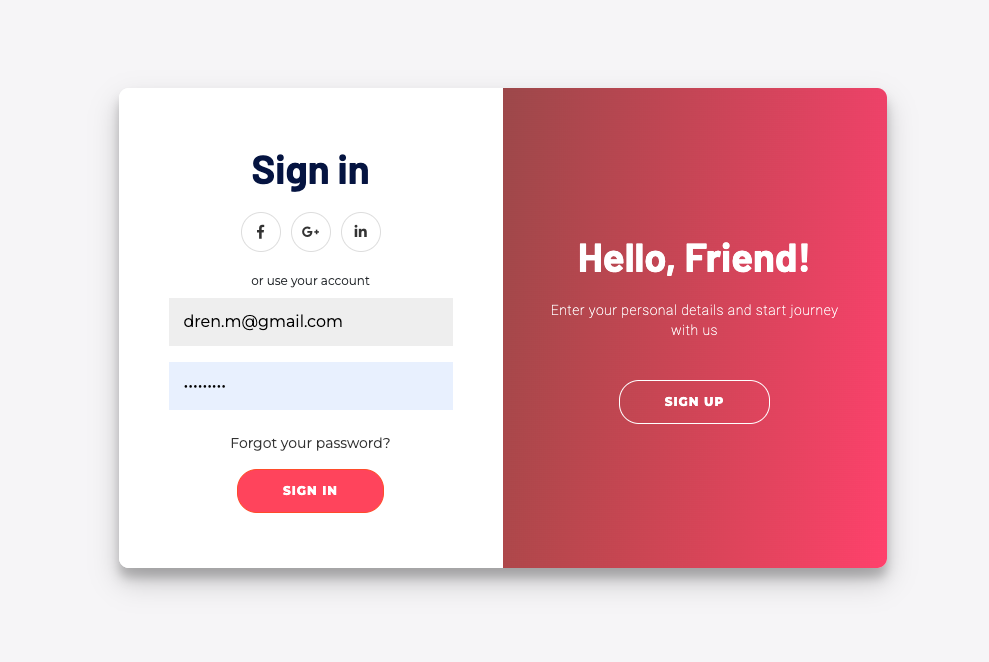
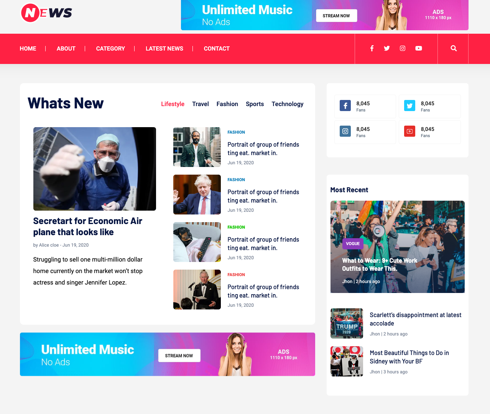
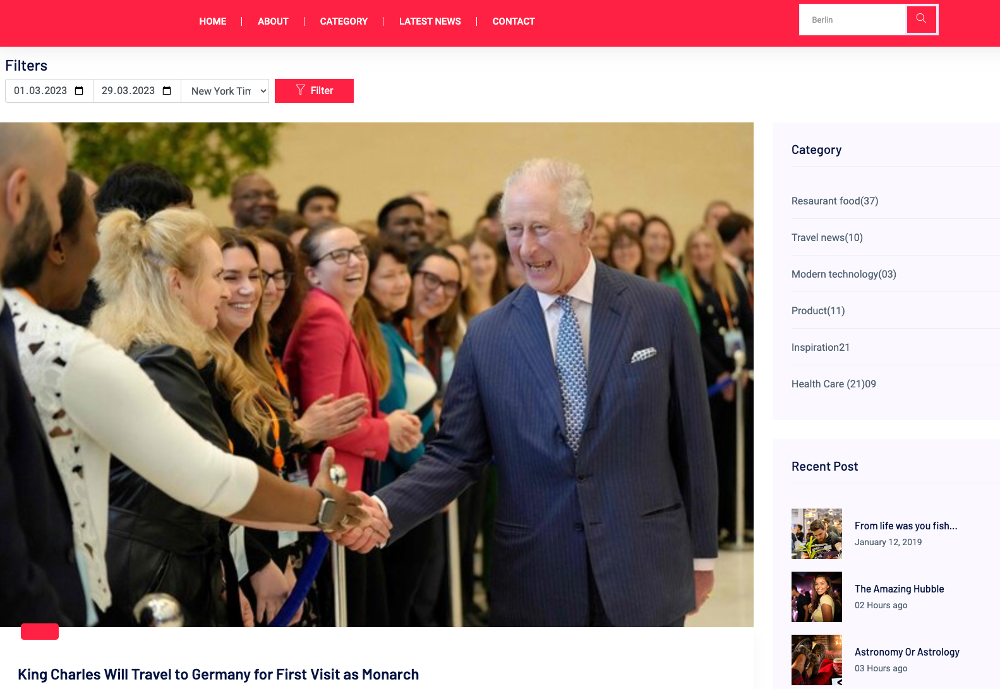
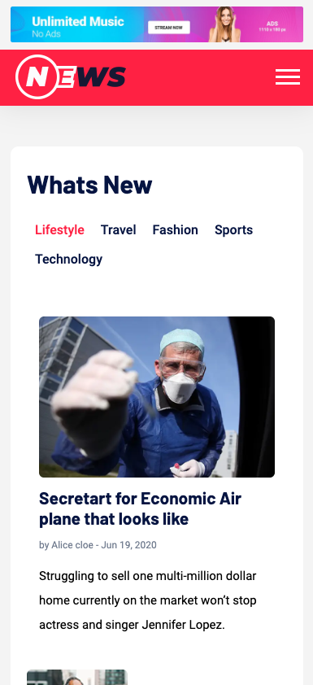
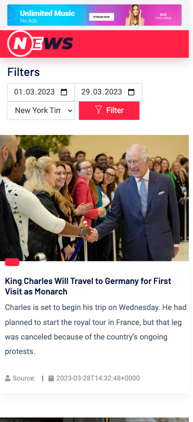
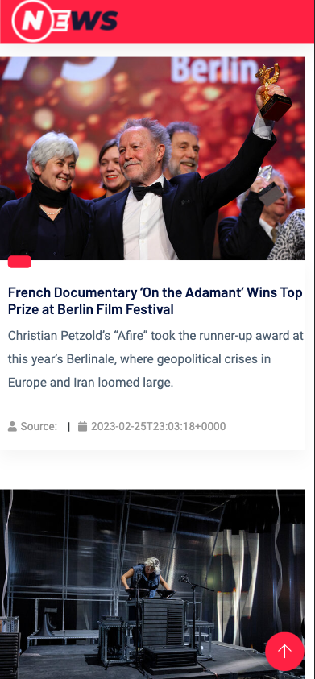

# Welcome to the News App

This project is created from Dren Mullafetahu as a test application for Innoscripta.

## Installation

In order to run the application you have two options:
### Option A
#### Seperate
You can run the apps (Front end and Backend seperately)
#### For Backend (on backend folder) do the following
1. Create a copy of `.env` file from  `.env.example` file and replace your configurations.
2. Run `composer install`.
3. Run `php artisan migrate` to create the tables and the database.
4. Run `php artisan serve`

#### For Front-End (on frontend folder) do the following
1. Run `npm install` to install the dependencies.
2. Run `npm start` to start the app.
3. Open [http://localhost:3000](http://localhost:3000) to view it in your browser.

Note: The apps run by default port:3000 for front-end and port:8000 for backend.
If you want to change them you can change it on router.jsx for front-end and `php artisan serve --port:xxxx` by adding a port flag on backend.

### Option B
#### Using Docker
1. Copy `.env.example` to `.env` (on backend Folder)
2. On your terminal go to the root of the project (news-app) and run `docker-compose up --build -d` to create the docker containers. 
This will create 3 containers 1 for backend 1 for front-end and one for mysql .
3. Run `docker ps` to list the created containers.
4. Find and copy the `<your_db_containerId>` It should be something like (`news-app-master-db-1`).
5. On .env file locate `DB_HOST=127.0.0.1` and replace with `DB_HOST=<your_db_containerId>`
6. Inside backend container (`docker exec -it <your_backend_containerId> bash`) run `php artisan migrate` to create the database and the tables inside and exit.
7. Run again `docker-compose up --build -d` to rebuild.
8. Run `docker compose up` to start the apps.
9. Visit [http://localhost:3000](http://localhost:3000) to view it in your browser.

Note: 
1. I use Mac M1 Silicone chip on my computer, therefore I am required to use a different `db: platform:` configuration for my db Platform.
If you use a different Intel chip or PC please change
`db: platform: linux/x86_64` on `docker-compose.yaml` to your preference.

## Dependencies
News-app is created with Laravel on backend and reactjs on front-end with axios as a promise-based HTTP Client.  
It uses News API-s from: 
1. NewsAPI.org
2. Guardian
3. New York Times

Other:
1. composer.
2. mysql.

Notes:
1. NewsApi limits to only 100 requests per day for development use.
2. You must include the API_Keys from `.env.example` to `.env` on backend folder.

## How to use

1. Register by creating an account.
2. You can choose your Favourite Categories and Sources to make it personalized. Your selections are saved in the database for next time.
3. You can Search all the articles from 3 different sources on the header search. 
4. On search page you have filters by date and source.

## How it works
1. Authentication is made with Laravel Oauth.
2. User is created in database by registering.
3. Validation is added to Login and Register.
4. After Registration an ACCESS_TOKEN is set to Session storage. On logout it's deleted.
5. On home page when the prefered categories and Source is seletected, a axios request is made to backend routes and then the api calls to collect news dataare made from backend. Also selected categories and source are saved to database for the personalized feed.
6. Same goes for search. User searches, the input goes to backend routes and then the api calls are made from the selected filters.
7. SearchParams are used to make the search and filters.
8. Logout destroys the token.

## Some Screenshots

### Mobile responsiveness

## Developer

Dren Mullafetahu ❤️
